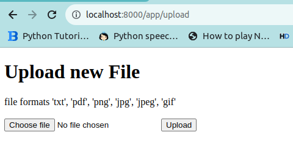

## start flask

1. clone project and move to project dir
2. pip install flask
3. python3 app.py

### verify if flask is running

## Steps to setup Kong
1. setup OSS kong using package or docker
  - https://konghq.com/install

2. create service

  curl -i -s -X POST http://localhost:8001/services \
    --data name=web-app \
    --data url='http://localhost:5000'

### replace localhost with your host ip | as localhost might cause problem when using docker

3. create route

  curl -i -X POST http://localhost:8001/services/web-app/routes \
  --data 'paths[]=/app' \
  --data name=app_route

4. visit proxy 

localhost:8000/app/

